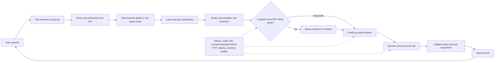

# Reading note: tool schemas, prefill, KV cache, and tries

## 1. How tool definitions enter an LLM request

A tool-capable API normally receives ordinary chat messages plus an ordered
array of tool definitions. Each definition contains a name, description, and
JSON Schema for its arguments. The serving stack's model-specific chat template
serializes those objects into text or special tokens before inference. The model
does not call a Python function while thinking; it generates a structured tool
name and arguments, which the surrounding agent validates and executes.

Therefore, a catalog has two representations:

1. the API object used by the agent; and
2. the exact token sequence produced by a particular tokenizer and chat
   template.

Prefix caching operates on the second representation. Semantically identical
JSON with a different key order, whitespace, tool order, template, or tokenizer
can create a different token prefix. TATM therefore uses one canonical JSON
serialization and must record the complete model/template configuration during
cluster experiments.

The [MCP tools specification](https://modelcontextprotocol.io/specification/draft/server/tools)
similarly describes named tools with `inputSchema` and optional output schemas.
An MCP client still has to map those definitions into the target model's prompt
format.

## 2. Prefill versus decode

An autoregressive transformer has two operational phases:

- **Prefill** processes the prompt tokens. Attention for all prompt positions can
  be computed in parallel subject to the causal mask. This phase constructs the
  key/value (KV) state needed for generation and is usually compute-heavy for a
  long tool catalog.
- **Decode** produces one new token at a time. Each layer computes a new query,
  key, and value for the latest token. The query attends to keys from all prior
  positions and uses their values. Decode is often dominated by repeatedly
  reading a growing KV cache.

For each transformer layer and processed token position, the KV cache stores the
key and value vectors produced by that layer's attention projections. It does
not store a context-independent meaning of a tool. A token's deeper-layer state
already depends on the causal context that preceded it.

[PagedAttention](https://arxiv.org/abs/2309.06180) separates logical token
positions from physical KV blocks, reducing fragmentation and allowing blocks
to be shared. Paging solves memory placement; it does not by itself make two
different prefixes equivalent.

## 3. Exact automatic prefix caching

With vLLM automatic prefix caching (APC), a completed full token block can be
identified by a hash that includes its token IDs and the hash of its parent
block. A later request can reuse the longest chain of matching full blocks.
Only the uncached suffix needs prefill computation. The current public behavior
is summarized in the
[vLLM APC documentation](https://docs.vllm.ai/en/latest/features/automatic_prefix_caching/)
and [prefix-caching design note](https://github.com/vllm-project/vllm/blob/main/docs/design/prefix_caching.md).

Consider these tool sequences:

```text
Request 1: system, Tool A, Tool B, Tool C, user
Request 2: system, Tool A, Tool B, Tool D, user
```

The second request can reuse complete matching blocks through the shared
`system, A, B` prefix. It cannot jump over `C` and reuse the later user tokens
from request 1 because the parent hash chain and causal context differ.

APC can be reused when:

- the model, tokenizer, prompt template, and relevant cache-isolation inputs
  agree;
- token IDs match from the beginning;
- matching material reaches complete cache-block boundaries; and
- the blocks have not been evicted.

It cannot exactly reuse a suffix after the first changed token merely because
the remaining text is identical. It also does not reduce the number of tokens
processed during decode; it mainly avoids repeated prefill work. This is why
cached tokens, computed prefill tokens, TTFT, total latency, and memory all need
to be reported together.

## 4. Why tool order matters

Suppose two selected sets are `{weather, map, calendar}` and
`{weather, calendar, email}`.

```text
Alphabetical request 1: calendar, map, weather
Alphabetical request 2: calendar, email, weather
Shared tool prefix:     calendar

Workload order 1:      weather, calendar, map
Workload order 2:      weather, calendar, email
Shared tool prefix:    weather, calendar
```

The set overlap is the same, but the longest common ordered prefix differs.
Putting globally frequent or strongly co-occurring tools first may expose more
exact prefix sharing. However, reordering can also change a model's tool choice
because tool position is part of the prompt. Every systems comparison therefore
needs a function-calling quality comparison.

Classic [FP-Growth](https://www.cs.sfu.ca/~jpei/publications/sigmod00.pdf)
sorts items by global support before inserting transactions into an FP-tree.
For the first baseline, “FP-tree global order” and “frequency order” are
deliberately the same order. Conditional pattern mining or cost-aware path
selection would be a later, genuinely different algorithm.

## 5. Why arbitrary KV deletion or concatenation is not exact

It is tempting to precompute each tool independently and concatenate its KV
blocks later. In a standard causal transformer this is generally not equivalent
to prefill of the concatenated text:

1. A token in Tool B attends to Tool A when the prompt is `A, B`. Tool B
   prefilled alone did not receive that context, so its hidden states and
   deeper-layer K/V differ.
2. RoPE rotates queries and keys according to token position. Moving an
   independently computed block requires position handling, but correcting
   position alone does not restore the missing contextual attention.
3. Deleting a middle block leaves later K/V states that were computed while
   attending to the deleted content.
4. Joining blocks produced under different parent prefixes breaks the exact
   causal history represented by APC's hash chain.

[RoFormer](https://arxiv.org/abs/2104.09864) explains the positional rotation,
while [CacheBlend](https://arxiv.org/abs/2405.16444) illustrates why reused
non-prefix chunks may require selective recomputation. Such techniques can be
valuable, but they are not the semantics-preserving first baseline.

## 6. Trie representation

A trie stores one edge per ordered tool and shares nodes among sequences with
the same prefix:

```text
root
└── weather
    ├── calendar
    │   ├── map
    │   └── email
    └── currency
```

For three sequences of lengths 3, 3, and 2, a naive representation uses eight
tool nodes. The trie above uses five. If native APC retains the corresponding
token blocks, the tree is also a conceptual map of reusable exact prefixes.
Physical vLLM cache blocks remain managed by vLLM; the initial TATM prototype
does not mutate KV tensors.

A weighted trie can attach measurements to each node or edge:

- benchmark support or replay request count;
- canonical schema token cost;
- measured prefill time;
- cache-block footprint;
- pair/conditional support;
- recency or session locality;
- tool-selection quality change; and
- authorization/active-tool constraints.

An admission policy could then retain paths with high expected saved prefill
work per cache byte. Frequency alone may favor many short tools; multiplying
support by schema cost is a simple competing baseline.

## 7. Proposed request flow



The active/authorized set is decided before ordering. Reordering must not grant
access to a cached but inactive tool. If later work retains inactive schemas to
extend a prefix, a fresh active-tool manifest and constrained validation become
load-bearing safety controls.

## 8. What the local and cluster experiments establish

The local pipeline can measure schema sizes, benchmark support, co-occurrence,
controlled replay locality, and analytical trie sharing. Those values answer
whether the public tasks contain a plausible prefix-locality signal.

Only the CUDA/vLLM experiment can establish:

- the exact rendered prompt tokens and full-block hit boundary;
- cache hits/queries and cached versus computed prompt tokens;
- prefill time and TTFT;
- KV/GPU memory and eviction behavior; and
- equality of generation under cache-enabled and cache-disabled serving.

The local trie estimate is therefore a hypothesis generator, not a reported
latency result.
