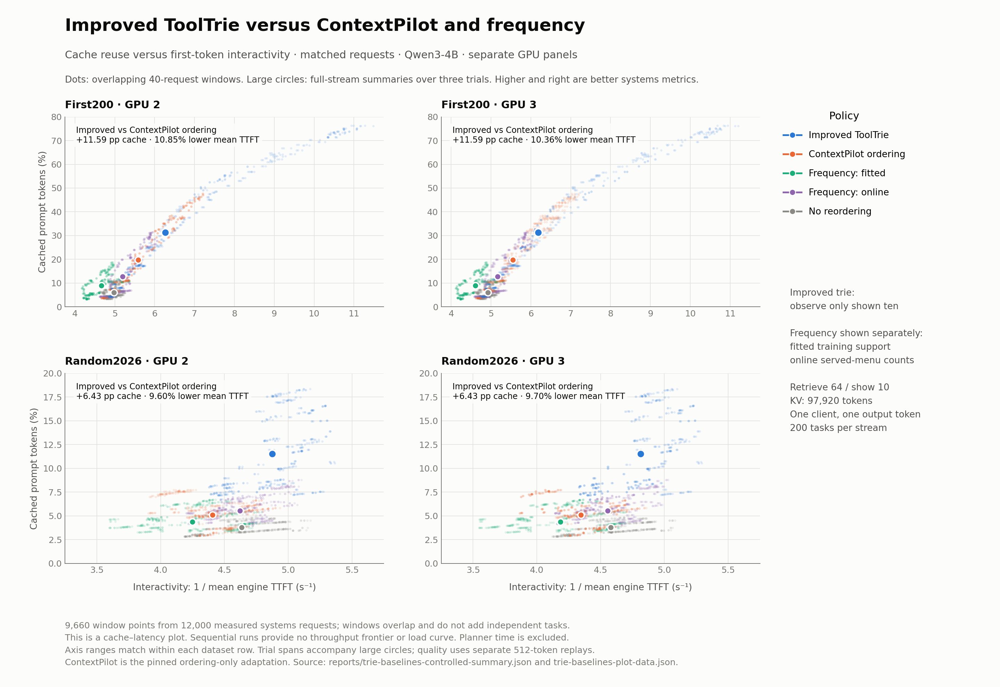

# Improved ToolTrie: cache hit and miss rate, F1, and latency

How much of each prompt vLLM reuses or computes under the **new trie that observes only the ten shown tools**, compared with ContextPilot ordering, fitted frequency, online frequency, no reordering, and the previous ToolTrie-v1.

**Data:** 96/96 independently accepted replays, 19,200 measured requests, and 400 excluded warmup requests. Qwen3-4B, vLLM 0.26.0, dense retrieve-64 / show-10, with separate RTX 3090 GPU 2 and GPU 3 replication. The [audited summary](../trie-baselines-controlled-summary.json) is the source for every table.

**Measurement pairing:** cache and latency come from three one-token systems replays per policy/dataset/GPU. F1 comes from a separate **512-token quality replay of the same frozen requests and menus**. These are matched inputs, not the same replay. The earlier 128-token improvement study is separate evidence.

## Summary

- **First200:** improved-trie hit rate is **31.33%** (miss **68.67%**), versus ContextPilot ordering 19.74% and no reordering 5.98%. Tool-ID F1 is **24.567**, versus 23.033 and 25.483, respectively.
- **Random2026:** improved-trie hit rate is **11.52%** (miss **88.48%**), versus ContextPilot ordering 5.09% and no reordering 3.80%. Tool-ID F1 is **20.473**, versus 17.135 and 21.935, respectively.
- **Efficiency and quality need separate conclusions.** The new trie improves cache reuse and mean TTFT over these external baselines on both streams, but does not maximize F1. Paired intervals below describe uncertainty; an interval containing zero does not establish equivalent quality.
- **F1 versus ContextPilot remains uncertain.** Both paired 95% intervals cross zero; higher point estimates do not establish a quality gain.
- **Frequency has two meanings here.** Fitted frequency uses a separate training corpus; online frequency counts tools shown on earlier requests. Their selection behavior and quality differ substantially.

## Where the new trie improves systems results

Positive reductions mean less computed prompt work or shorter mean TTFT. F1 changes are improved trie minus comparator; intervals are paired task bootstrap 95% intervals.

### First200

| Comparator | Hit %: comparator → new | Computed-token reduction | Mean TTFT reduction: GPU 2 / 3 | F1 change [95% interval], pp: GPU 2 / 3 |
|---|---:|---:|---:|---|
| ContextPilot ordering | 19.74 → 31.33 | +14.65% | +10.85% / +10.36% | +1.533 [-2.217, +5.450] (both) |
| Frequency: fitted | 8.91 → 31.33 | +31.55% | +25.54% / +25.46% | -1.550 [-7.067, +3.833] (both) |
| Frequency: online | 12.70 → 31.33 | +22.44% | +17.13% / +16.56% | +21.483 [+15.767, +27.350] (both) |
| No reordering | 5.98 → 31.33 | +26.86% | +20.58% / +20.45% | -0.917 [-3.167, +1.167] (both) |
| Previous ToolTrie-v1 | 27.35 → 31.33 | +5.47% | +4.03% / +3.80% | -0.333 [-1.833, +1.167] (both) |

### Random2026

| Comparator | Hit %: comparator → new | Computed-token reduction | Mean TTFT reduction: GPU 2 / 3 | F1 change [95% interval], pp: GPU 2 / 3 |
|---|---:|---:|---:|---|
| ContextPilot ordering | 5.09 → 11.52 | +11.46% | +9.60% / +9.70% | +3.338 [-0.562, +7.383] (both) |
| Frequency: fitted | 4.37 → 11.52 | +14.37% | +12.85% / +13.02% | +4.830 [-0.554, +10.199] (both) |
| Frequency: online | 5.54 → 11.52 | +6.87% | +5.19% / +5.33% | +15.348 [+9.764, +21.219] (both) |
| No reordering | 3.80 → 11.52 | +6.44% | +4.90% / +4.86% | -1.462 [-3.245, +0.058] (both) |
| Previous ToolTrie-v1 | 5.85 → 11.52 | +4.47% | +3.33% / +3.39% | -0.801 [-2.200, +0.375] (both) |

**Where the new trie does not win:** no reordering has a higher F1 point estimate on both streams, and fitted frequency has a higher point estimate on First200. These data do not define a combined quality/efficiency objective or select an overall winner.

## Evaluation data and request fairness

| Item | Matched setting |
|---|---|
| First200 | 200 previously inspected tasks: 101 APIBank, 99 APIGen |
| Random2026 | 200 previously inspected tasks from 27 ToolRet sources |
| Overlap | Three shared task IDs; 397 distinct tasks across both streams |
| Retrieval | Same dense-retrieved 64 candidates, query, labels and request order for every policy |
| Model input | Ten tools per request; policy may change membership and order |
| Names | Common stable unique function-name mapping for every policy |
| Engine | Qwen3-4B pinned revision; vLLM 0.26.0; BF16; eager; TP1; temperature/seed 0; thinking disabled |
| KV capacity | Fixed and checked: 6,120 × 16 = 97,920 tokens on each GPU |
| Execution | One sequential client; cache reset before each replay; first request has zero cached tokens |
| Replication | Every policy on GPUs 2 and 3; three rotated systems trials; reversed policy order on GPU 3 |

The independent audit checked all 2,400 policy requests. These controls make the query streams and candidate pools comparable. Selected ten-tool menus and policy history rules still differ, so this comparison measures selection plus ordering.

## 1. First200: cache hit/miss and tool-ID F1

| Policy | Hit | Miss | Any gold tool in ten shown | All gold tools in ten shown | Tool-ID F1 ×100 | New − policy F1, pp |
|---|---:|---:|---:|---:|---:|---:|
| **Improved ToolTrie** | 31.33% | 68.67% | 59.0% | 35.5% | 24.567 | +0.000 |
| ContextPilot ordering | 19.74% | 80.26% | 47.0% | 28.5% | 23.033 | +1.533 |
| Frequency: fitted | 8.91% | 91.09% | 39.0% | 28.5% | 26.117 | -1.550 |
| Frequency: online | 12.70% | 87.30% | 8.0% | 5.5% | 3.083 | +21.483 |
| No reordering | 5.98% | 94.02% | 62.0% | 37.5% | 25.483 | -0.917 |
| Previous ToolTrie-v1 | 27.35% | 72.65% | 61.5% | 36.5% | 24.900 | -0.333 |

Cache totals and quality metrics in this table match across the two GPUs. **New − policy F1** is the point difference in favor of the improved trie; paired intervals are reported above. Menu coverage is a selection metric, not the model's actual success rate.

## 2. Random2026: cache hit/miss and tool-ID F1

| Policy | Hit | Miss | Any gold tool in ten shown | All gold tools in ten shown | Tool-ID F1 ×100 | New − policy F1, pp |
|---|---:|---:|---:|---:|---:|---:|
| **Improved ToolTrie** | 11.52% | 88.48% | 57.0% | 29.0% | 20.473 | +0.000 |
| ContextPilot ordering | 5.09% | 94.91% | 45.5% | 21.5% | 17.135 | +3.338 |
| Frequency: fitted | 4.37% | 95.63% | 36.5% | 19.5% | 15.643 | +4.830 |
| Frequency: online | 5.54% | 94.46% | 10.5% | 5.5% | 5.125 | +15.348 |
| No reordering | 3.80% | 96.20% | 58.0% | 29.0% | 21.935 | -1.462 |
| Previous ToolTrie-v1 | 5.85% | 94.15% | 57.5% | 28.5% | 21.274 | -0.801 |

Cache totals and quality metrics in this table match across the two GPUs. **New − policy F1** is the point difference in favor of the improved trie; paired intervals are reported above. Menu coverage is a selection metric, not the model's actual success rate.

## 3. Computed prompt tokens and latency

Counts are totals over 200 requests. TTFT is the mean of three trial means; ± is their sample standard deviation. Device timings are kept separate. These are engine measurements with one output token, excluding offline planning and full response generation.

### First200

| Policy | Prompt tokens | Cached tokens | Computed tokens | Mean TTFT ± SD, GPU 2 / 3 (ms) |
|---|---:|---:|---:|---:|
| Improved ToolTrie | 290,380 | 90,976 | 199,404 | 159.54 ± 0.43 / 161.65 ± 0.78 |
| ContextPilot ordering | 291,075 | 57,456 | 233,619 | 178.96 ± 0.04 / 180.33 ± 1.70 |
| Frequency: fitted | 319,777 | 28,480 | 291,297 | 214.27 ± 0.30 / 216.85 ± 0.23 |
| Frequency: online | 294,515 | 37,408 | 257,107 | 192.52 ± 0.18 / 193.73 ± 0.61 |
| No reordering | 289,965 | 17,328 | 272,637 | 200.87 ± 0.38 / 203.21 ± 0.32 |
| Previous ToolTrie-v1 | 290,342 | 79,408 | 210,934 | 166.24 ± 0.53 / 168.04 ± 0.63 |

### Random2026

| Policy | Prompt tokens | Cached tokens | Computed tokens | Mean TTFT ± SD, GPU 2 / 3 (ms) |
|---|---:|---:|---:|---:|
| Improved ToolTrie | 311,372 | 35,856 | 275,516 | 205.17 ± 0.55 / 207.79 ± 0.24 |
| ContextPilot ordering | 327,858 | 16,672 | 311,186 | 226.96 ± 0.98 / 230.12 ± 0.13 |
| Frequency: fitted | 336,461 | 14,720 | 321,741 | 235.43 ± 0.84 / 238.90 ± 0.41 |
| Frequency: online | 313,200 | 17,360 | 295,840 | 216.40 ± 0.21 / 219.50 ± 0.16 |
| No reordering | 306,099 | 11,632 | 294,467 | 215.75 ± 0.66 / 218.41 ± 0.37 |
| Previous ToolTrie-v1 | 306,335 | 17,920 | 288,415 | 212.22 ± 0.51 / 215.07 ± 0.04 |

A higher cache percentage alone does not imply less work: policies can select schemas of different lengths. Cached and computed token counts expose that denominator difference.

### Request-window figure

[PNG](../figures/improved-trie-cache-interactivity.png) · [SVG](../figures/improved-trie-cache-interactivity.svg)



The five requested policies contribute **9,660 plotted window points from 12,000 measured systems requests**. Each point uses 40 consecutive requests (stride one): x = 1 / mean engine TTFT; y = total cached / total prompt tokens ×100. Windows stay within one policy, dataset, device and trial. They overlap and do not add independent tasks. Large circles summarize three full replays; horizontal spans show the three-trial range. For each dataset, both GPU panels share axis limits; the two datasets use different ranges to keep their distributions legible.

This is a cache–latency comparison in the historical frontier's visual style. It contains no throughput measurement or fitted load curve. A throughput frontier for the improved policy requires a separately controlled load sweep.

## 4. What each policy knows

| Policy | Selection, order and history |
|---|---|
| Improved ToolTrie (`served_only`) | Plan 64, show ten, observe only shown ten; reuse the v1 planning core |
| Previous v1 | Plan 64, show ten, observe all 64 |
| ContextPilot ordering | Pinned official persistent API orders 64, show ten; native API observes all 64 |
| Fitted frequency | Rank by disjoint training gold-support counts; tool-ID tie break |
| Online frequency | Rank by counts in earlier shown menus; original-name/ID tie break; observe shown ten |
| No reordering | Show the retriever's first ten in retrieval order |

Fitted frequency uses **7,474 training tasks**, excluding 487 tasks whose IDs or whitespace-normalized queries overlap evaluation. The audit reconstructed training support and all 800 frequency decisions. Evaluation labels never rank the tools.

Online frequency's alphabetical tie break can displace relevant tools before any useful history exists, and observing only its shown menus can reinforce those choices. Its low F1 is a result of this specific selector, not a general claim that frequency methods fail.

ContextPilot is pinned to `1fa0a143fdeda344585666648ab2b30cb7fea77f`, with alpha 0.001, average linkage and persistent CPU planning. Full and prefix builds were checked for reproducibility and causality. This is an **ordering-only adaptation**: scheduling, annotations, de-duplication and engine eviction feedback are outside the comparison. It does not evaluate the full ContextPilot system.

Both trie policies use a 128-request recency window, at most 100,000 nodes and 190,896 canonical schema tokens of planner metadata. This budget is distinct from the engine's physical KV allocation.

## How to read the numbers

- **Hit / miss:** cached / computed prompt tokens, divided by all prompt tokens; they sum to 100%. This is token-weighted reuse, not the fraction of requests with any cache hit.
- **F1:** mean task-level tool-ID F1 across all tasks, including those whose menus omit gold tools. Unknown called names count as false positives. Arguments and execution correctness are not graded.
- **Uncertainty:** 10,000 paired task bootstrap resamples, seed 20260919, conditional on each frozen stream; exploratory comparisons without an equivalence margin. Crossing zero does not prove quality preservation.
- **Ratios:** hit-rate multiples are not latency speedups. Reciprocal-TTFT percentage gains differ from TTFT percentage reductions.

## Limits and output-budget check

| Dataset | Policy | At 512-token limit / 200 | Explicit length finish / 200 |
|---|---|---:|---:|
| First200 | Improved ToolTrie | 0 | 0 |
| First200 | ContextPilot ordering | 0 | 0 |
| First200 | Frequency: fitted | 0 | 0 |
| First200 | Frequency: online | 0 | 0 |
| First200 | No reordering | 0 | 0 |
| First200 | Previous ToolTrie-v1 | 0 | 0 |
| Random2026 | Improved ToolTrie | 5 | 5 |
| Random2026 | ContextPilot ordering | 4 | 4 |
| Random2026 | Frequency: fitted | 4 | 4 |
| Random2026 | Frequency: online | 2 | 2 |
| Random2026 | No reordering | 5 | 5 |
| Random2026 | Previous ToolTrie-v1 | 6 | 6 |

Per-request cache vectors match across all six systems replays in 12/12 policy/dataset cells. Quality outputs match on 2,400/2,400 cross-device requests. Replays and devices do not create additional unique evaluation tasks.

- Two previously inspected streams, one arrival order per stream, one model, one KV capacity and sequential traffic. No unseen-task or production-load claim follows.
- Automatic clocks, temperature and host scheduling can differ despite identical GPU models and KV allocation; comparisons within each GPU are primary.
- This study has a 512-token quality budget and unique function names. The earlier 128-token study and historical raw-name results are separate; their absolute scores are not pooled here.
- The fixed-ten follow-up is separate. This report does not isolate ordering gains from menu-selection changes.

## Reproduce

```bash
uv run scripts/report_improved_trie_comparison.py
```

This reproduces the report and PNG/SVG from the committed audited summary and [compact request metrics](../trie-baselines-plot-data.json), without a GPU. [Publication hashes](../trie-baselines-publication.json) identify the exact inputs and outputs. Raw responses, telemetry and the experimental source snapshot remain under the ignored raw root and are needed to repeat the independent experimental audit.

To rebuild the compact request metrics from that accepted raw archive:

```bash
uv run scripts/report_improved_trie_comparison.py \
  --raw-root cluster/results/trie-baselines-controlled-20260919-01
```

Experimental manifest SHA-256: `afea6f0b559c10d89c8e3f43baee888603e4ab1c521da0820185bb0a0e7cab80`.

Summary SHA-256: `b43f396ebc18b7333c8d9fa3be5ee6c75cb6f8bf7284a867ee66e91361fd3a1f`.
