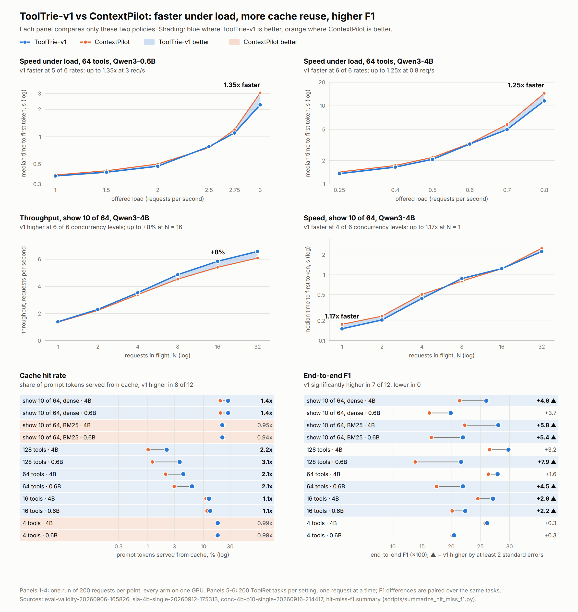
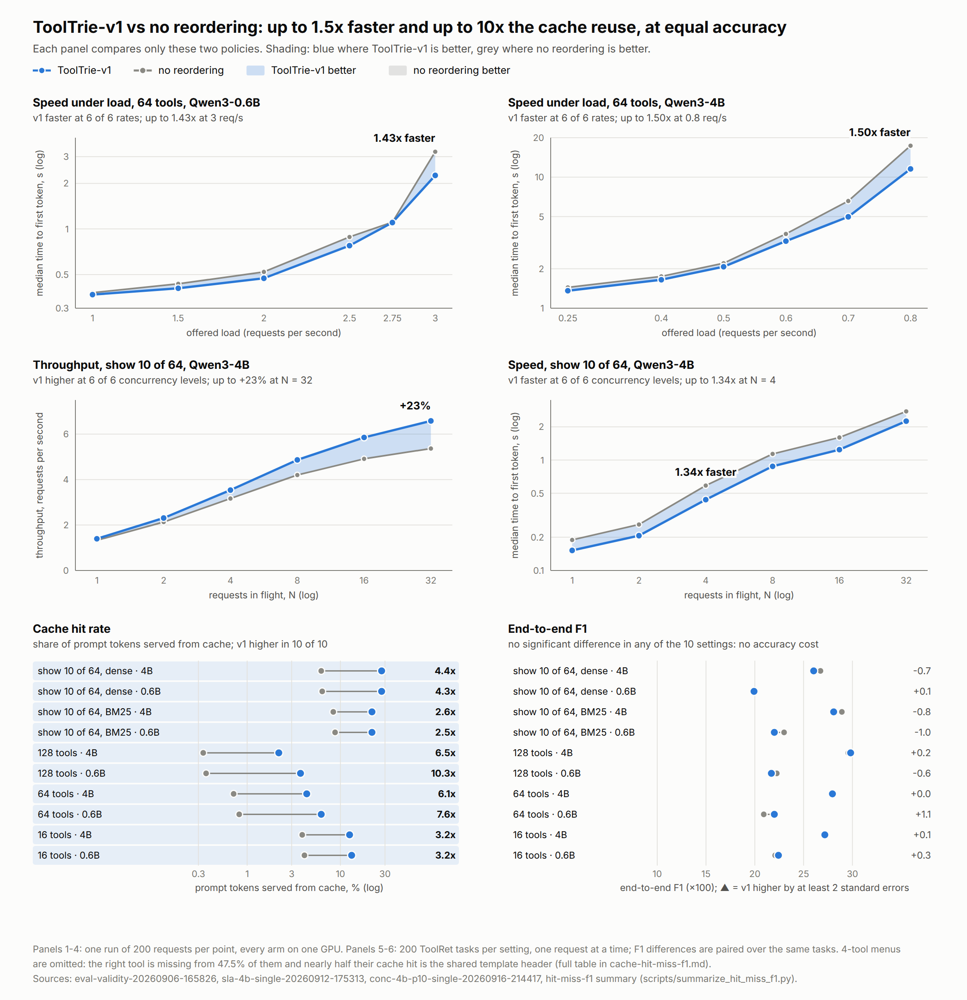
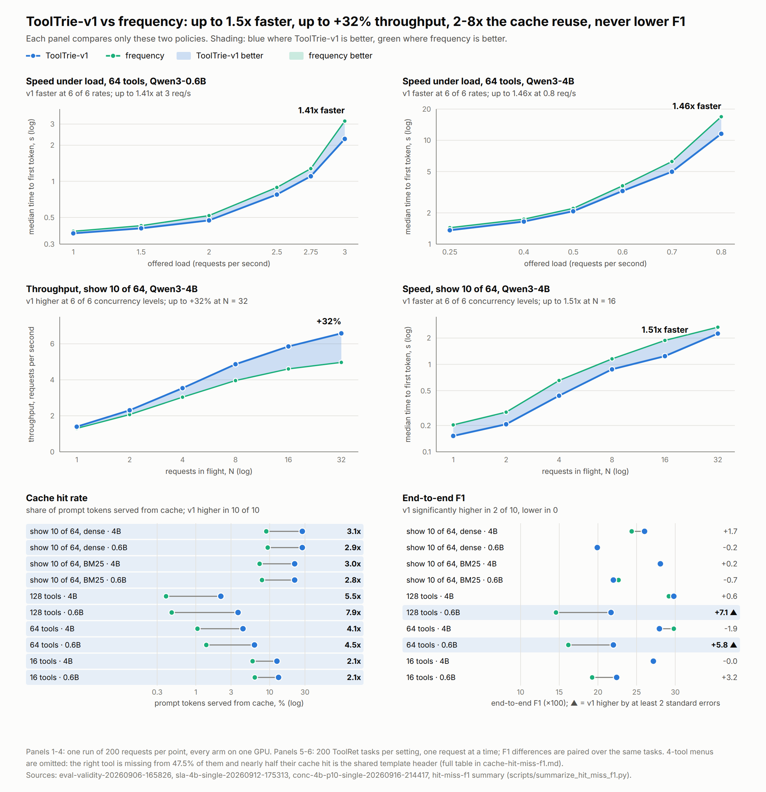
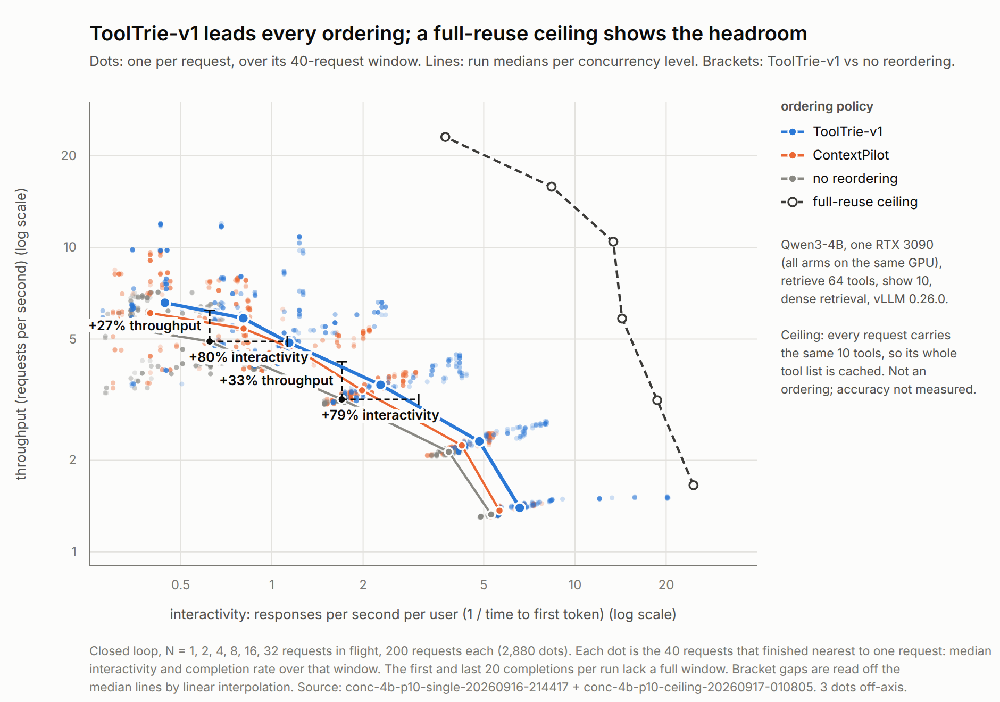
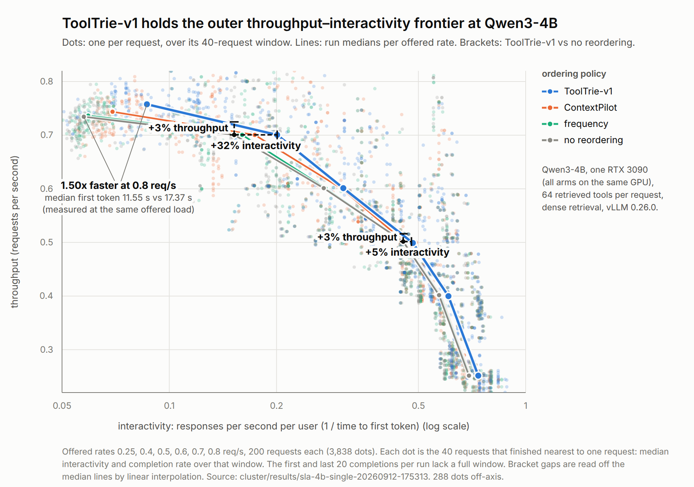
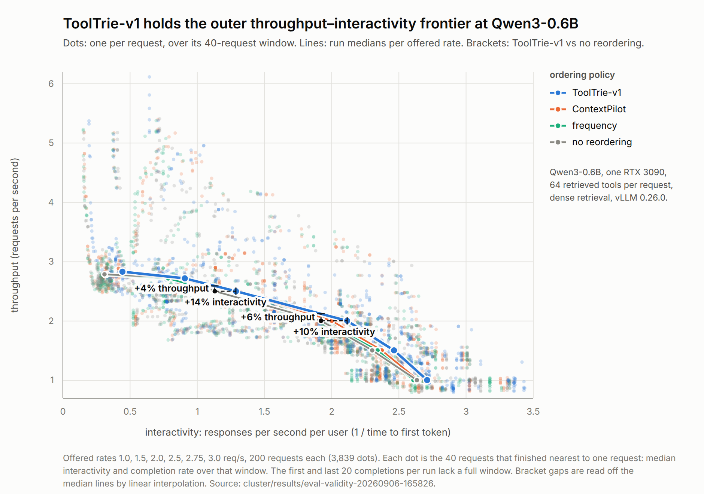

# ToolTrie-v1 figures

Every figure for the ToolTrie-v1 results, with its main takeaway. Each links to
a PNG (for slides) and an SVG (for the paper). The numbers behind them, with
cache hit/miss and F1 per setting, are in
[`cache-hit-miss-f1.md`](../concurrent-latency/cache-hit-miss-f1.md).

All runs: ToolRet tool menus retrieved from the full 44,453-tool catalogue by a
dense retriever (unless marked BM25), unmodified vLLM 0.26.0 with automatic
prefix caching, every policy for a given model on the same GPU.

## Head to head: ToolTrie-v1 against one rival at a time

Each panel shows only the two policies. The gap is shaded blue where
ToolTrie-v1 is better and in the rival's colour where the rival is better.

### vs ContextPilot (the strongest baseline)

[PNG](head-to-head-contextpilot.png) · [SVG](head-to-head-contextpilot.svg)



- Faster under load at 6 of 6 offered rates on Qwen3-4B (up to 1.25x) and 5 of 6
  on Qwen3-0.6B (up to 1.35x).
- Higher throughput at all 6 concurrency levels on retrieve 64 / show 10 (up to +8%).
- Higher cache hit rate in 8 of 10 settings (up to 3.1x).
- End-to-end F1 significantly higher in 7 of 10 settings and never lower.

### vs no reordering

[PNG](head-to-head-no-reordering.png) · [SVG](head-to-head-no-reordering.svg)



- Faster at every offered rate on both models, up to 1.43x (0.6B) and 1.50x (4B).
- Up to +23% throughput and 1.34x faster on retrieve 64 / show 10.
- 2.5x to 10.3x the cache hit rate in all 10 settings.
- No significant F1 difference anywhere: the gains cost no accuracy.

### vs frequency ordering

[PNG](head-to-head-frequency.png) · [SVG](head-to-head-frequency.svg)



- Faster at every offered rate on both models, up to 1.41x (0.6B) and 1.46x (4B).
- Up to +32% throughput and 1.51x faster on retrieve 64 / show 10.
- 2.1x to 7.9x the cache hit rate in all 10 settings.
- End-to-end F1 significantly higher in 2 of 10 settings (0.6B, 64 and 128
  tools) and never lower.

## Throughput–interactivity frontiers

One curve per policy; up and to the right is better.

### Qwen3-4B, retrieve 64 / show 10, with a full-reuse ceiling

[PNG](throughput-interactivity-frontier-4b-p10.png) · [SVG](throughput-interactivity-frontier-4b-p10.svg)



Closed loop, 1 to 32 requests in flight. ToolTrie-v1's curve lies outside
ContextPilot's and no reordering's; at 32 in flight it serves 23% more requests
per second than no reordering. The dashed ceiling (every request given the same
tools, so the whole tool list is cached) marks the headroom left for any
caching method; it is not an ordering and its accuracy is not measured.

### Qwen3-4B, 64 tools

[PNG](throughput-interactivity-frontier-4b.png) · [SVG](throughput-interactivity-frontier-4b.svg)



Open loop, 0.25 to 0.8 requests per second offered. ToolTrie-v1 is 1.50x faster
than no reordering at 0.8 req/s (median first token 11.55 s vs 17.37 s).
Log interactivity axis.

### Qwen3-0.6B, 64 tools

[PNG](throughput-interactivity-frontier.png) · [SVG](throughput-interactivity-frontier.svg)



Open loop, 1.0 to 3.0 requests per second offered. ToolTrie-v1 holds the outer
frontier; the brackets give its gain over no reordering at matched throughput
and matched interactivity.

## Regenerating

```bash
python3 scripts/plot_head_to_head.py --rival cp_online      # also: original, frequency
python3 scripts/plot_throughput_frontier.py --model 4b-p10-conc  # also: 4b, 0.6b
```

PNGs are 2x renders of the SVGs with headless Chromium.
