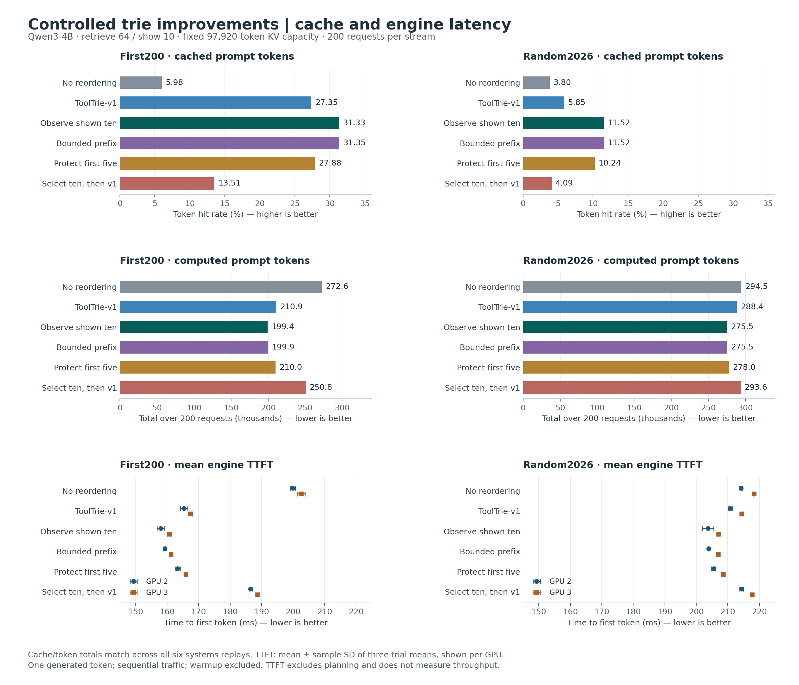
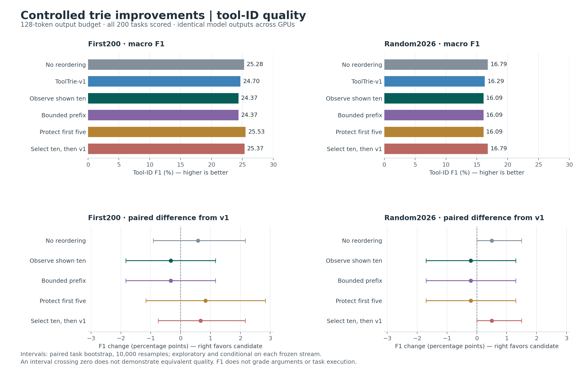
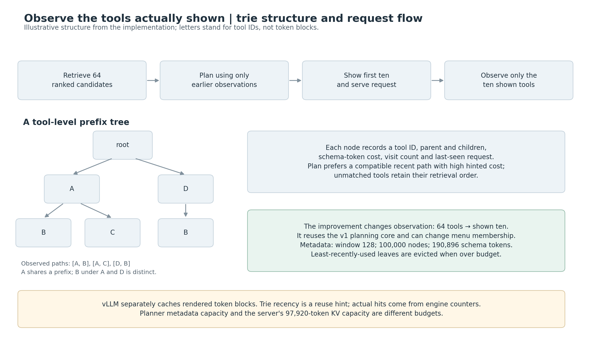

# Controlled trie improvements: figures and results

**Accepted study completed 19 September 2026: 96/96 replays, 19,200 measured requests, 400 excluded warmup requests.**

Generated from the [audited summary](trie-improvements-controlled-summary.json). This publication covers the completed six-policy improvement study. The newer matched ContextPilot/frequency matrix and fixed-menu follow-up are separate experiments; their results are not included here.

## Main finding

Observing only the ten shown tools improves cache reuse and engine TTFT over v1 on both fixed streams. F1 point estimates decline slightly; the paired intervals do not establish quality preservation. These results do not select an overall winner or a new production default.

| Dataset | Cache hit %: v1 → observe ten | Computed-token reduction | TTFT reduction: GPU 2 / GPU 3 | F1 change [95% interval], pp |
|---|---:|---:|---:|---:|
| First200 | 27.35 → 31.33 | 5.47% | 4.47% / 4.00% | -0.333 [-1.833, +1.167] |
| Random2026 | 5.85 → 11.52 | 4.47% | 3.36% / 3.43% | -0.200 [-1.700, +1.300] |

## Figures

### Cache, computation and latency

[PNG](figures/controlled-trie-systems.png) · [SVG](figures/controlled-trie-systems.svg)



Cache/token totals are identical across all six systems replays for each policy/dataset. TTFT is shown separately for each GPU: error bars are the sample standard deviation of three trial means, not task confidence intervals. The TTFT axis starts at 145 ms; cache and token bars start at zero.

### Quality and uncertainty

[PNG](figures/controlled-trie-quality.png) · [SVG](figures/controlled-trie-quality.svg)



GPU quality outputs agree on all 2,400 policy requests. Repeating tasks across GPUs does not increase the number of independent tasks. Bootstrap intervals use 10,000 task resamples, seed 20260918, conditional on each frozen sequence; comparisons are exploratory.

### Structure and observation rule

[PNG](figures/controlled-trie-structure.png) · [SVG](figures/controlled-trie-structure.svg)



The tree is planner metadata over tool IDs. The shown-ten change uses the existing [v1 planner](../src/tatm/tooltrie_v1.py) and [trie core](../src/tatm/tooltrie.py). Its recorded paths end after the shown menu. This diagram is illustrative, not a dump of an experimental tree.

## All measured policies

| Figure label | Policy | Rule |
|---|---|---|
| No reordering | `original` | Show the retriever's first ten in retrieval order |
| ToolTrie-v1 | `v1` | Plan 64; show ten; observe all 64 |
| Observe shown ten | `served_only` | Plan 64; show ten; observe only shown ten |
| Bounded prefix | `bounded` | Score rendered compatible prefixes up to ten; observe shown |
| Protect first five | `protect5` | Bounded policy with the retriever's first five guaranteed inclusion |
| Select ten, then v1 | `top10_then_v1` | Select the original top ten, then reorder and observe those ten |

Except for no reordering and select-ten-then-v1, policies can change which ten tools are shown. This is a joint selection/ordering comparison. The fixed-ten arm isolates ordering relative to no reordering.

### First200

| Policy | Hit % | Prompt tokens | Computed tokens | Mean TTFT ± SD, GPU 2 / GPU 3 (ms) | Tool-ID F1 % |
|---|---:|---:|---:|---:|---:|
| No reordering | 5.98 | 289,965 | 272,637 | 199.88 ± 0.80 / 202.56 ± 1.20 | 25.283 |
| ToolTrie-v1 | 27.35 | 290,342 | 210,934 | 165.35 ± 1.17 / 167.38 ± 0.53 | 24.700 |
| Observe shown ten | 31.33 | 290,380 | 199,404 | 157.96 ± 1.22 / 160.68 ± 0.52 | 24.367 |
| Bounded prefix | 31.35 | 291,147 | 199,867 | 159.33 ± 0.54 / 161.20 ± 0.35 | 24.367 |
| Protect first five | 27.88 | 291,160 | 209,992 | 163.30 ± 0.79 / 165.90 ± 0.16 | 25.533 |
| Select ten, then v1 | 13.51 | 289,965 | 250,781 | 186.50 ± 0.52 / 188.73 ± 0.54 | 25.367 |

### Random2026

| Policy | Hit % | Prompt tokens | Computed tokens | Mean TTFT ± SD, GPU 2 / GPU 3 (ms) | Tool-ID F1 % |
|---|---:|---:|---:|---:|---:|
| No reordering | 3.80 | 306,099 | 294,467 | 214.20 ± 0.41 / 218.29 ± 0.24 | 16.792 |
| ToolTrie-v1 | 5.85 | 306,335 | 288,415 | 210.79 ± 0.54 / 214.37 ± 0.26 | 16.292 |
| Observe shown ten | 11.52 | 311,372 | 275,516 | 203.71 ± 1.77 / 207.01 ± 0.12 | 16.092 |
| Bounded prefix | 11.52 | 311,372 | 275,516 | 203.97 ± 0.27 / 206.96 ± 0.20 | 16.092 |
| Protect first five | 10.24 | 309,751 | 278,039 | 205.49 ± 0.70 / 208.52 ± 0.12 | 16.092 |
| Select ten, then v1 | 4.09 | 306,099 | 293,587 | 214.37 ± 0.55 / 217.72 ± 0.17 | 16.792 |

## Metric definitions and controls

- **Hit rate:** total cached prompt tokens / total prompt tokens. It is not the percentage of requests with any hit. Prompt lengths vary with selected tools; computed-token totals capture actual prompt work.
- **Latency:** engine time to first token, one generated token per request, sequential traffic. Offline planning is excluded; these measurements do not establish production throughput or full client latency.
- **F1:** macro tool-ID F1 over all tasks, including menus missing the relevant tools; unknown names count as false positives. Arguments and task execution are not graded. The uniform 128-token quality budget can truncate outputs.
- **Samples:** First200 contains 101 APIBank and 99 APIGen tasks; Random2026 contains 200 tasks from 27 ToolRet sources. Three IDs overlap, giving 397 distinct tasks. Both streams were previously inspected; they are exploratory rather than untouched holdouts.
- **Fair requests:** identical queries, labels, order and 64 retrieved candidates; ten distinct tools shown per policy; same original schemas except a common unique function-name map. The audit checked all 2,400 policy requests. Different menu membership remains a material difference.
- **Server:** Qwen/Qwen3-4B revision `1cfa9a7208912126459214e8b04321603b3df60c`, vLLM 0.26.0, BF16, eager, TP1, temperature/seed 0, thinking disabled. Maximum model length 32,768; one sequence; no chunked prefill.
- **GPUs:** initially idle RTX 3090 devices 2 and 3, used sequentially. Every policy runs on each GPU. KV capacity is fixed and verified at 6,120 blocks × 16 = 97,920 tokens. Cache resets before each replay; first request must have zero cached tokens. Warmup is excluded; three systems trials rotate policy order, reversed on GPU 3.
- **Remaining variability:** temperature, automatic clocks, and host scheduling can differ. Device timings remain separate. The interrupted GPU 3 attempt was excluded in full; this summary uses the completed retry only.
- **Historical separation:** unique tool names change tokenization and potentially model behavior. Do not pool this study with historical raw-name scores, the newer 512-token quality experiment, or old concurrency results.

## Interpretation

The simple observation change yields a consistent systems gain. Bounded-prefix scoring adds no clear benefit here: on First200 it reports a slightly higher hit fraction but computes more tokens than observing ten with the v1 core. Select-ten-then-v1 has much smaller gains, especially on Random2026. This limits attribution of the larger gains to ordering alone.

This study contains no fresh ContextPilot or frequency arm, so it cannot establish the improved policy's advantage over those methods. Historical figures remain available in the [figure index](figures/README.md), with their original experimental conditions and quality limitations.

## Reproduce and trace

From the repository root:

```bash
uv run scripts/plot_controlled_trie.py
```

This regenerates three PNG/SVG pairs, this report and a [SHA-256 publication manifest](figures/controlled-trie-publication.json) from the committed compact summary. It requires no GPU or raw data. Matplotlib 3.10.1 is installed by uv into an isolated script environment.

- Experimental manifest SHA-256: `31efe62052d9992378cfc42723dbeea11ac0458be5c45e3e2def75c05c9ee6a2`.
- Independent analysis script SHA-256: `cc259d9757e76ea78b4cf8ca823e337a927af69264817f4dc8b430ce6a5a392c`.
- Summary SHA-256: `3d41a3a099c4fc3ffbb2ca58cdf9cb1302944061a68d2da52c6ca238effdf5de`.
- Raw run directory: `cluster/results/trie-improvements-controlled-20260918-04/` (ignored by Git). Its raw responses, telemetry and frozen source snapshot are required to rerun the independent experimental audit; the committed summary supports figure reproduction only.
